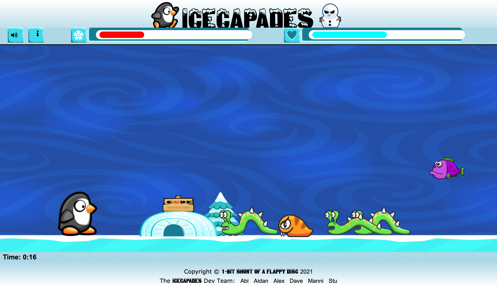
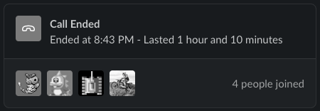
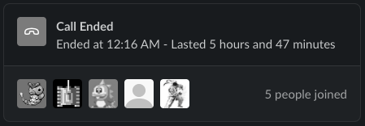
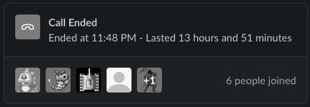
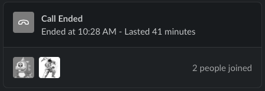
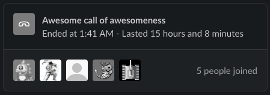

# Icecapades


[Here is a link to the final project](https://abibubble.github.io/icecapades)

Icecapades is a modern take on the classic endless runner games. With simple controls and enjoyable gameplay, it aims to provide countless hours of entertainment. It even has a secret easter egg to find!

We chose this as our hackathon project to give an innovative new twist on a well known (and incredibly frustrating) style of gameplay. Repeatedly trying the same things in an attempt to achieve different results, perhaps something that is a little too relateable by many software developers!

Unfortunately this game is not responsive to all mobile devices. It's best played on a regular-sized desktop screen.



## Contents

* [User Experience (UX)](#user-experience-(ux))
  * [Initial Discussion](#initial-discussion)
  * [User Stories](#user-stories)

* [Design](#design)
  * [Color Scheme](#color-scheme)
  * [Typography](#typography)
  * [Imagery](#imagery)
  * [Wireframes](#wireframes)
  * [Features](#features)
  * [Future Features](#future-features)
  * [Audio](#audio)

* [Teamwork](#teamwork)

* [Technologies Used](#technologies-used)
  * [Languages Used](#languages-used)
  * [Frameworks, Libraries & Programs Used](#frameworks-libraries-and-programs-used)

* [Deployment](#deployment)
  * [Initial Deployment](#initial-deployment)
  * [How to Fork it](#how-to-fork-it)
  * [How to Clone it](#how-to-clone-it)
  * [Making a Local Clone](#making-a-local-clone)

* [Testing](#testing)
  * [W3C Validator](#w3c-validator)
  * [Testing User Stories](#testing-user-stories)
  * [Full Testing](#full-testing)
  * [Further Testing](#further-testing)
  * [Solved Bugs](#solved-bugs)
  * [Known Bugs](#known-bugs)
  * [Lighthouse](#lighthouse)
    * [Performance](#performance)
    * [Accessibility](#accessibility)
    * [Best Practices](#best-practices)
    * [SEO](#seo)

* [Credits](#credits)
  * [Code](#code)
  * [Content](#content)
  * [Media](#media)
  * [Acknowledgements](#acknowledgements)

---

## User Experience (UX)

### Initial Discussion
The criteria for the August 2021 [Code Institute](https://codeinstitute.net) Hackathon is **Retro Gaming**.  
We intend to provide a user friendly, thoroughly enjoyable application that takes the user back to when games were great. Simple to play, extremely hard to put down. We are aiming for square eyes and cramping fingers as our users endeavour to get Tux safely back home.

---

### User Stories

#### Client Needs

* A retro game that provides clear and substantial value to the user
* Use an original or innovative idea, design or implementation
* Has a well structured and completed documentation (README & Wireframes)
* Is well-planned and executed (using GitHub projects)
* Focus is realistic, and has an overall sense of completeness.

#### First Time Visitor

* Intuitive controls
* Clear rules/goals of the game
* Simple and logical navigation
* Positive emotive response

#### Returning Visitor

* Varied gameplay with increasing difficulty

---

## Design

### Color Scheme

* The game is focused around an ice/snow theme. This allowed us to utilise a blue/white colour scheme, with some more vibrant colours to highlight relevant elements.

### Typography

* We have chosen the Snowtop Caps font for our heading from [1001fonts](https://www.1001fonts.com/snowtop-caps-font.html) as it fits our ice/snow theme and is also free to use for commercial use.

### Imagery

We have chosen Tux, the Linux logo, as our playable character. He is related to code, fits into a theme very easily and promotes a positive emotive response.  
His enemies are a couple of 'juiced-up' worms and slugs, seeking revenge on a bird for all their relatives that have been eaten throughout the years.  
The boss is a snowman, called Brian Shady Grady. This is in-keeping with the icy theme and provides a tangible enemy with fun projectiles.

* To save time, we have utilised some free sprite libraries for animated characters and backgrounds. They were sourced from:
  * [gameartguppy](https://www.gameartguppy.com/)
  * [opengameart](https://opengameart.org/)
  * [gamedeveloperstudio](https://www.gamedeveloperstudio.com/)
  * [gamedevmarket](https://www.gamedevmarket.net/)
* The sprite for the carrot projectile used by the snowman boss is from [opengameart](https://opengameart.org/content/easter-carrot-pick-up-item), the additional images to create the animation were generated using [Paint 3D](https://www.microsoft.com/en-gb/p/paint-3d/9nblggh5fv99?activetab=pivot:overviewtab).

### Wireframes

[Here are the wireframes for desktop, mobile and tablet for this project](static/docs/icecapades.pdf).

### Features

* Tux can slide by holding the down arrow button. Tux lays down which makes him move faster and also avoid obstacles.
* Modals have been used to show the instructions of the game, when the game has been won or when Tux has been killed.
* Brian, the evil snowman boss of the game is introduced at the end of the level as the boss fight.
* Snowflakes which are collected by Tux to add more ammo, and can be used to kill enemies during game play.
* Snowball bar has been added to show how many snowballs Tux has left.
* Health bar has been added to indicate how much health Tux has during game play.
* Fish that are collected during game play increase Tux's health.
* An Easter Egg when you win the game - we won't spoil the surprise, you'll have to get Tux home safely!

### Future Features

* Give enemies their own movement speed.
* Leaderboard so users can see how they did compared to their friends.

### Audio

* All audio is controlled by the audio on / off button, so that the user can choose if they'd like to hear audio.
* A cute 8-bit tune can be heard throughout the game when the user turns on the audio.
* There are also sound effects when the user has the audio on, for the following actions:
  * Tux jump
  * Tux kills a slug
  * An enemy is hit by a snowball
  * Tux catches a fish
  * Tux is hit
  * Tux slides
  * Tux collects a snowflake
  * Tux throws a snowball

---

## Teamwork
* As a team, we got on incredibly well. After a slightly nervous first call, we settled in as a team, and really started working together.
* We had calls open in Slack throughout the time we had (after 6pm Wednesday - Friday and all day Saturday and Sunday).
* This provided an open and friendly space for all questions.
* Once two of the team were online, the call was started, and it then ran until all but one team member signed off for the night.
* There was no pressure to join the calls, but the calls were there for people to jump in and out of as they wished.
* We ensured that everyone had the space to have their say.
* Having a call running also meant that if anyone was stuck, or didn't understand something, they could jump on the call, have a little learning moment, and then get back on with their work.
* This also meant that while some members of our team had more code lines typed in, everyone was involved in the work.
* Out personalities also meshed very well, so the Slack calls were filled with laughing, joking, and fun, while also being a safe learning space for everyone.

* First introduction call, meeting each other, discussing basic ideas


* Second call, deciding on actual final game ideas, getting sprites for characters and world building.


* Third call, building the base HTML, styling the progress bar, and adding characters onto the canvas.


* Fourth call, working through movements, fish and snowflake drops, and enemy population.


* We did a couple of little breakout calls, to target specific issues in pairs for more focus.



* Seventh call, working through hit mechanics, the final boss battle, and bug fixes.


---

## Technologies Used

### Languages Used

* [HTML5](https://developer.mozilla.org/en-US/docs/Web/Guide/HTML/HTML5)
* [CSS3](https://developer.mozilla.org/en-US/docs/Archive/CSS3#:~:text=CSS3%20is%20the%20latest%20evolution,flexible%20box%20or%20grid%20layouts.)
* [JavaScript](https://developer.mozilla.org/en-US/docs/Web/JavaScript)

### Frameworks Libraries and Programs Used

#### Font Awesome

* [Font Awesome](https://fontawesome.com/) was used on all pages to add the instructions, home, settings and copyright icons.

#### Git

* [Git](https://git-scm.com/) was used for version control by utilizing the Gitpod terminal to add and commit to Git and push to GitHub.

#### GitHub

* [GitHub](https://github.com/) is used to store the code for this project after being pushed from Git.

#### Balsamiq

* [Balsamiq](https://balsamiq.com/) was used to create the wireframes during the design process.

#### Google DevTools

* [Google DevTools](https://developer.chrome.com/docs/devtools/) was used to help me find what code correlated to what feature.

#### Shields.​io

* [Shields.io](https://shields.io/) was used to create the GitHub badges for this README.md file.

#### Sprites

* [Stitches](http://draeton.github.io/stitches/) was used to generate animation sprites to simplify the coding process.

#### Favicon

* [Favicon.io](https://favicon.io/) was used to create a favicon from an image.

#### Adobe Online

* [Adobe Online](https://www.adobe.com/express/feature/image/transparent-background) was used to remove the background for the favicon image.

---

## Deployment

### Initial Deployment

This site was deployed to GitHub Pages by following these steps:

1. Login or Sign Up to [GitHub](www.github.com).
2. Create a new repository named "icecapades".
3. Once created, click on "Settings" on the navigation bar under the repository title.
4. Scroll down to "GitHub Pages".
5. Under "Source", choose which branch to deploy. I chose "main", but this is sometimes shown as "master".
6. Choose which folder to deploy from, usually "/root".
7. Click "Save", then wait for it to be deployed. It can take some time for the page to be fully deployed.
8. Your URL will be displayed above "Source".

### How to Fork it

1. Login or Sign Up to [GitHub](www.github.com).
2. On GitHub, go to [Abibubble/icecapades](https://github.com/Abibubble/icecapades).
3. In the top right, click "Fork".

### How to Clone it

1. Login or Sign Up to [GitHub](www.github.com).
2. Fork the repository Abibubble/icecapades using the steps above in [How to Fork it](#how-to-fork-it).
3. Above the file list, click "Code".
4. Choose if you want to clone using HTTPS, SSH, or GitHub CLI, then click the copy button to the right.
5. Open Git Bash.
6. Change the directory to where you want your clone to go.
7. Type git clone and then paste the URL you copied in step 4.
8. Press Enter to create your clone.

### Making a Local Clone

1. Log in to [GitHub](www.github.com) and locate the [Repository](https://github.com/Abibubble/icecapades) for this site.
2. Under the repository name, above the list of files, click "Code".
3. Here you can either Clone or Download the repository.
4. You should clone the repository using HTTPS, clicking on the icon to copy the link.
5. Open Git Bash.
6. Change the current working directory to the new location, where you want the cloned directory to be.
7. Type git clone, and then paste the URL that was copied in Step 4.
8. Press Enter, and your local clone will be created.

For a more detailed version of these steps, go to the [Github Docs](https://docs.github.com/en/github/creating-cloning-and-archiving-repositories/cloning-a-repository#cloning-a-repository-to-github-desktop) page on this topic.

---

## Testing

### W3C Validator

The W3C Markup Validator, W3C CSS Validator and JSHint were used to validate the project to ensure there were no syntax errors within the site.

1. W3C Markup Validator
    * [HTML Results](https://validator.w3.org/nu/?doc=https%3A%2F%2Fabibubble.github.io%2Ficecapades%2F)

2. W3C CSS Validator
    * [CSS Results](https://jigsaw.w3.org/css-validator/validator?uri=https%3A%2F%2Fabibubble.github.io%2Ficecapades%2F&profile=css3svg&usermedium=all&warning=1&vextwarning=&lang=en)

3. JSHint
    * [JSHint](https://jshint.com/)

### Testing User Stories

#### Client Goals

> A retro game that provides clear and substantial value to the user

* It is a retro-style side-scrolling game.
* It's a fun game with easy replayability.

> Use an original or innovative idea, design or implementation

* We have implemented this game using the HTML canvas element, with JavaScript to draw the game.
* The character we have used is Tux, the Linux mascot. This links the game back to coding, and also allowed the theme to be an icy, winter-y theme.

> Has a well structured and completed documentation (README & Wireframes)

* The README file clearly documents all important aspects of our project, along with testing and design ideas.
* The wireframes also show our planning and the clear vision we had for the finished game.

> Is well-planned and executed (using GitHub projects)

* [The Project board](https://github.com/Abibubble/icecapades/projects/1) is easily visible.
* It shows our progress throughout the project.

> Focus is realistic, and has an overall sense of completeness.

* We had to scale back a few of our ideas, in order to be realistic for the deadline.

#### First Time Visitor Goals

> Intuitive controls

* The game uses a mix of the two main standard gaming controls:
  * W to Jump, S to Slide, and D to Shoot
  * Up arrow key to Jump, Down arrow key to Slide, Space bar to Shoot

> Clear rules/goals of the game

* The controls and rules are clearly defined in the Instructions modal.

> Simple and logical navigation

* The site only has two pages.
* The main page has easily understandard icons on all buttons
* All buttons are clear to understand what they do.

> Positive emotive response

* We have used the nostalgia that a lot of people have for Tux.
* For many youngsters, Tux taught them to type, and thus, holds a special place in their hearts.

#### Returning Visitor Goals

> Varied gameplay with increasing difficulty

* The enemies are all randomised, so it varies constantly.

#### Desktop / Laptop

1. Google Chrome
    * All tested and working correctly.

2. Microsoft Edge
    * All tested and working correctly.

3. Mozilla Firefox
    * All tested and working correctly.

4. Safari
    * All tested and working correctly.

### Further Testing

The website was tested on Google Chrome, Firefox, Microsoft Edge, Safari and Samsung Internet browsers. It was not tested on Internet Explorer, as it has been depreciated and is not recommended for use. The website was viewed on a variety of devices, including:

* Custom built desktop PC, running Windows 10
* Acer Aspire V Nitro Laptop, running Windows 10
* Lenovo B51 IntelCore i7 Laptop, running Ubuntu 16.04 LTS
* MacBook Pro (15-inch, 2017), running macOS Catalina
* MacBookAir7,2 (13-inch, 2017)
* iPad 6,11 5th generation, running iOS 10.3
* Amazon Fire tablet 7
* xBox One

A large amount of testing was done to ensure that all items were visible or hidden correctly, all characters and items were animated correctly, all buttons worked as they should, and the game played as it should.

### Solved Bugs

1. Having one modal open didn't stop another modal opening too.
    * We realised that the open modal function wasnt being called.
    * We added a check for a modal class in with other functions and this fixed the bug.

2. Stitching error, a background has a single line gap from top to bottom.
  *  the code below was used to close the stitching error in the background.
  
  ```
  if (this.x <= - this.width){
    this.x = this.width + this.x2 - this.speed;
  }
  if (this.x2 <= - this.width){
      this.x2 = this.width + this.x - this.speed;
  }
  ```

### Known Bugs

* There is occasionally an enemy that doesn't die when hit.

### Lighthouse

We tested our game using DevTools Lighthouse feature, and got these results:

#### Desktop


#### Performance:
* This has a good result, as we chose to not use any frameworks or libraries.

#### Accessibility:
* All images have alt text.
* All tap targets are correctly sized, and aren't overlapping other content.
* All colors are WCAG AA compliant.

#### Best Practices:
* This was knocked down due to issues in the console.
* The console error is due to the Permissions-Policy header, which we couldn't find a fix for.

#### SEO:
* All relevant meta tags have been included for full social media integration.
* All search engine relevant meta tags have been included with full content.

---

## Credits

### Code

* [Font Awesome](https://fontawesome.com/): Library of icons used for social media and download links.
* [Autoprefixer CSS online](https://autoprefixer.github.io/): To aid in the CSS prefixing.

### Content

* Unless otherwise mentioned, all content was created the the 1-Bit Short of a Flappy Disk team from [Code Institute](https://codeinstitute.net/).

### Audio Rights

* Game Audio - [Melody Loops](https://www.melodyloops.com/my-music/longoloops/slightly-anxious/)
* Sound effects - [ZapSplat](https://www.zapsplat.com/sound-effect-category/body-impacts/page/7/)

### Media Rights

* Character and background sprites:
  * [gameartguppy](https://www.gameartguppy.com/)
  * [opengameart](https://opengameart.org/)
  * [gamedeveloperstudio](https://www.gamedeveloperstudio.com/)
  * [gamedevmarket](https://www.gamedevmarket.net/)
  * [opengameart](https://opengameart.org/content/easter-carrot-pick-up-item)
* Additional images to create the animation were generated using [Paint 3D](https://www.microsoft.com/en-gb/p/paint-3d/9nblggh5fv99?activetab=pivot:overviewtab).

### Acknowledgements

* Our hackathon facilitator [Miklos Sarosi](https://github.com/Sarosim), at [Code Institute](https://codeinstitute.net/), for continuous helpful feedback and support.
* The team at [Code Institute](https://codeinstitute.net/), for teaching us the necessary skills to create this site.
* [Frank's Labratory](https://www.youtube.com/channel/UCEqc149iR-ALYkGM6TG-7vQ) for a few videos that really helped us start the development process.
